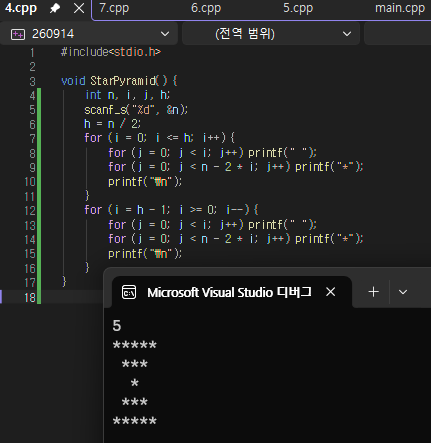
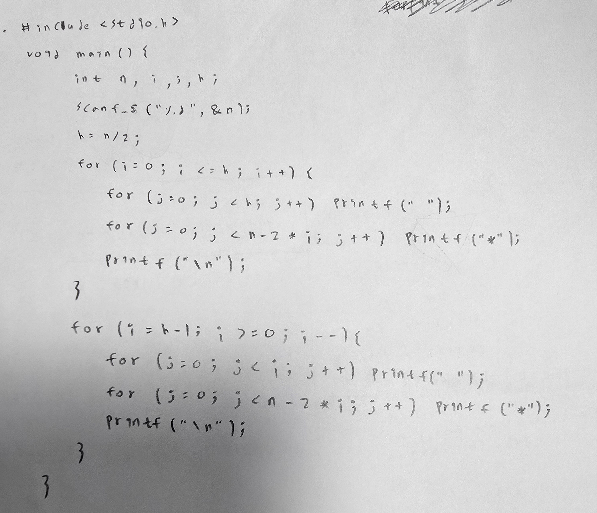
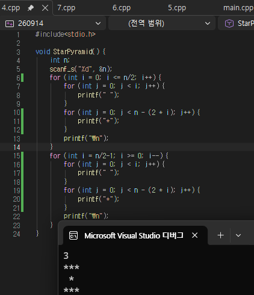
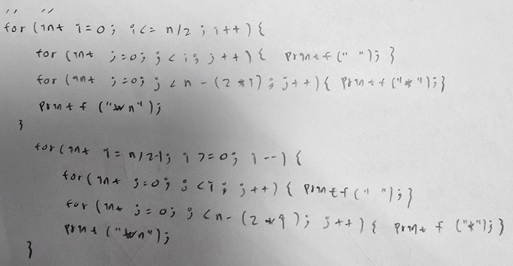
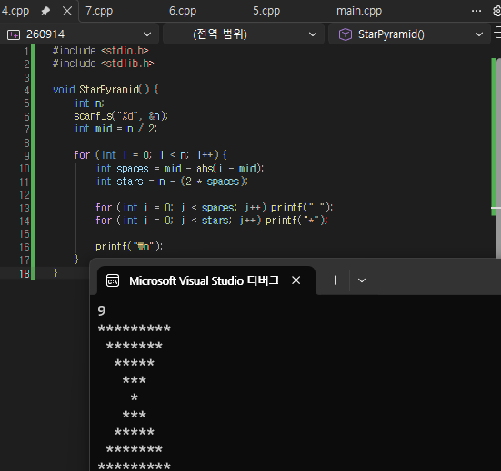
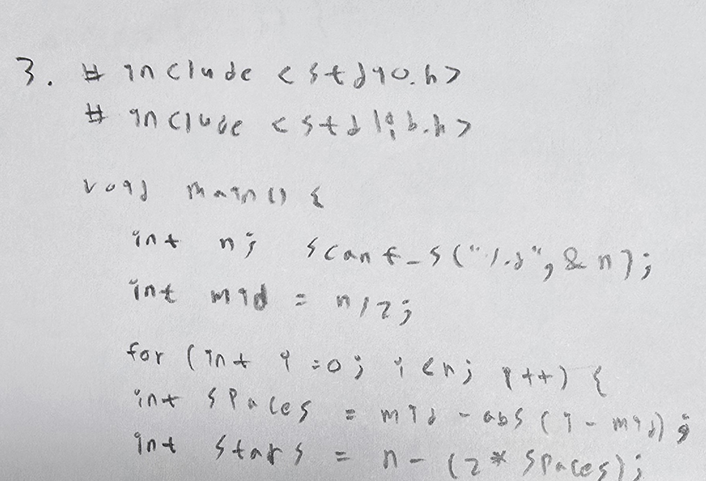
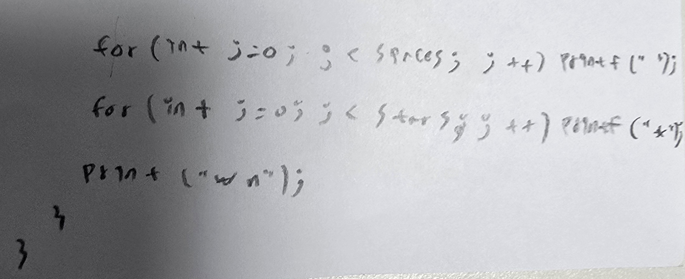

Q. 사용자로부터 모래시계의 높이(홀수 N)를 입력받아,  
입력한 크기에 맞는 모래시계 모양을 콘솔 화면에 출력하는 C언어 프로그램을 작성하시오.
	1. 입력: 사용자에게 3 이상의 홀수 N을 입력받습니다. (예: 3, 5, 7, 9 등)
	2. 출력: 입력받은 N에 맞는 모래시계를 출력합니다.
														20201095 김도협

직접 작성 : 

교수님 코드 :

AI 이용 작성 :

